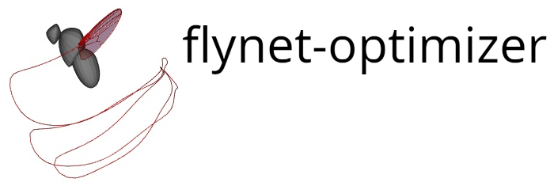

Particle swarm optimization extension module for flynet software from Melis,
Siwanowicz, and Dickinson 2024.

Note, this extension module should be automatically built and installed when installing 
the [flynet](https://github.com/flyranch/flynet) software.   

### System Requirements

Tested on ubuntu 22.04 with Python 3.11.4

### Build Dependencies 
The following libraries are required in order to build the software. They
should be installed using apt prior to installing the software itself.  

```bash
sudo apt install qtbase5-dev libvtk9-dev libarmadillo-dev libboost-python-dev libboost-numpy-dev
```

### Dependencies
The complete list of software dependencies can be found in the "dependencies"
section of the pyproject.toml file. All of the dependencies, aside from the
build dependencies listed above,  will be automatically installed by the
Package Installer for Python (pip) when the software is installed.

### Installation
Requires a working installation of Python 3.11.4. To install cd into the source
directory and run
```bash
pip install .
```
The installation typically takes around 5-10min. 


